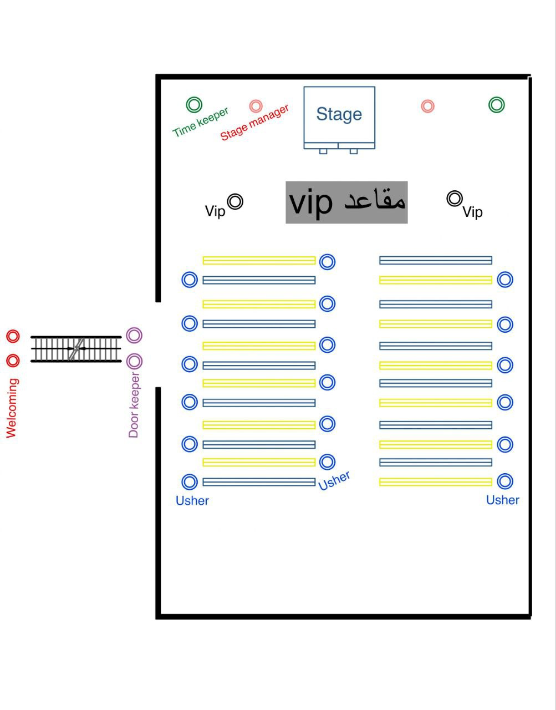

# plan for event execution:

### `قبل التنفيذ` 
- يتم تجهيز المخطط بالاتفاق مع لجنه ال PR و SM
  
- معرفه المكان المناسب لل event (او يتم رسمه او تجهيزه ع ابلكيشن ) 
  
- تنسيق المكان ومعرفه موقع كل شخص
  
- Logistics  (نحدد الماتريال اللي بنحتاجها)   
  ___

 ### `اثناء التنفيذ`
- الوصول قبل موعدال event بوقت كافي ( الافضل بساعتين )
  
-  الالتزام باليونيفورم المحدد
  
- لجنه ال ViP تستقبل الأشخاص بالاتفاق مع ال PR
  
- تجهز المكان لكل الأشخاص الموجوده 
  
- يتم توزيع اعضاء اللجنه علي الاماكن تبعاً لاتفاق مسبق 
  
- التأكد من توفير الاجهزه والتحضيرات اللازمه مثل الشاشات والمعدات (الصوت و الإضاءة)  

___
___
___

___
### ` بعد التنفيذ`
-  تقييم اليوم والمخطط 
  
- معرفة الأخطاء والمشاكل التي حدثت في اليوم ومحاولة علاجها والنطوير من اللجنه
  ___
  